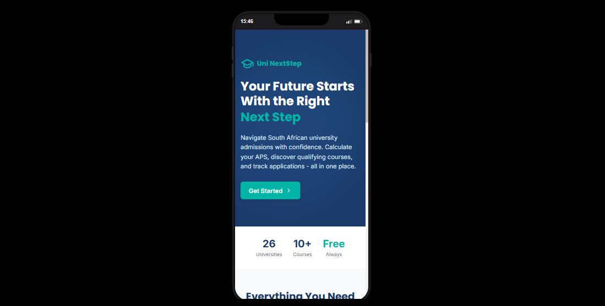
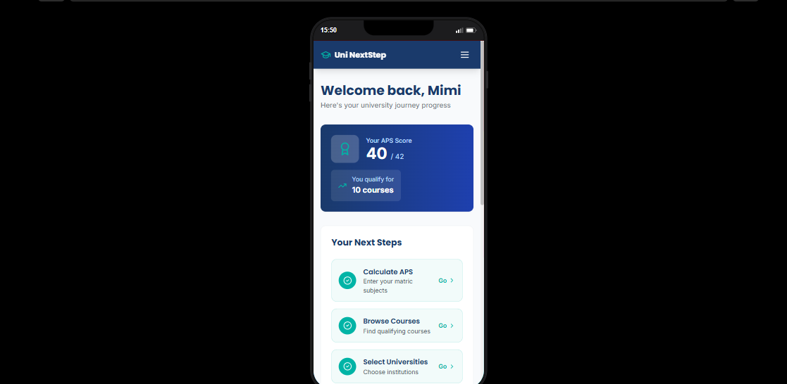
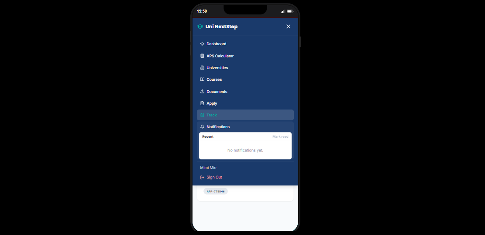
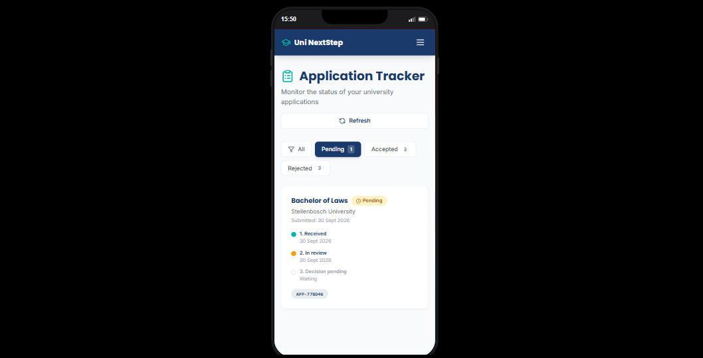

# Uni NextStep

Uni NextStep is a South African university guidance and application platform. Students can calculate APS, discover qualifying courses, upload application documents, submit applications, and track outcomes. Admin users can manage users, review applications, update statuses, send EmailJS notifications, and inspect activity/email history.

## Screenshots

| Desktop landing page | Mobile landing page |
|---|---|
|  |  |

| Mobile dashboard | Mobile navigation and notifications | Mobile application tracker |
|---|---|---|
|  |  |  |

## Key Features

- Student registration and login with JWT authentication.
- Admin login and role-protected admin routes.
- APS calculator using backend validation and South African APS rules.
- Seeded university and course catalog with minimum APS requirements.
- Course recommendations based on APS and selected filters.
- Application profile page for address, contact, guardian details, and required documents.
- Application submission with duplicate-application checks.
- Student application tracker with status timelines and activity history.
- Student in-app notifications with unread/read state.
- Context-aware in-app guidance assistant for student and admin questions.
- Admin user management with duplicate-email audit support.
- Admin application review with rejection reasons, notes, and decision checklist.
- Admin document preview/download support.
- EmailJS integration for application received and status update emails.
- Email delivery history and application activity logs.
- Report generation for users and applications.
- Responsive mobile layouts for student and admin workflows.
- Vercel , Render and Aiven (MySQL)

## Tech Stack

- React 18
- Vite
- Tailwind CSS
- React Router DOM
- Express
- MySQL
- JWT authentication
- EmailJS

The guidance assistant is implemented as a rule-based, context-aware support tool that reads existing app data. It does not require a paid external AI API key.

## Project Structure

```text
UNI/
|-- backend/
|   |-- db/
|   |-- middleware/
|   |-- routes/
|   |-- test/
|   |-- utils/
|   |-- database.js
|   `-- server.js
|-- emailjs-templates/
|-- screenshots/
|-- src/
|   |-- components/
|   |-- context/
|   |-- data/
|   |-- pages/
|   `-- services/
`-- README.md
```

## Local Setup

Install frontend dependencies:

```bash
npm install
```

Install backend dependencies:

```bash
cd backend
npm install
```

Create environment files from the examples:

```bash
copy .env.example .env
copy backend\.env.example backend\.env
```

Start the backend in one terminal:

```bash
cd backend
npm.cmd run dev
```

Start the frontend in another terminal:

```bash
npm.cmd run dev
```

Default local URLs:

- Frontend: `http://localhost:3000`
- Backend API: `http://localhost:5000/api`

## Free Hosting

For a free/demo deployment, use Vercel for the frontend, Render for the backend, and Aiven MySQL for the database. Full steps are in [DEPLOYMENT.md](DEPLOYMENT.md).

## Environment Variables

Frontend:

```env
VITE_API_URL=http://localhost:5000/api
```

Backend:

```env
PORT=5000
NODE_ENV=development
JWT_SECRET=replace-with-a-long-random-secret
ADMIN_EMAIL=admin@yourdomain.com
ADMIN_PASSWORD=replace-with-a-strong-admin-password
CORS_ORIGIN=http://localhost:5173,http://localhost:3000
DB_HOST=localhost
DB_PORT=3306
DB_USER=root
DB_PASSWORD=
DB_NAME=uni_nextstep
EMAILJS_SERVICE_ID=
EMAILJS_TEMPLATE_ID=
EMAILJS_RECEIVED_TEMPLATE_ID=
EMAILJS_STATUS_TEMPLATE_ID=
EMAILJS_ACCEPTED_TEMPLATE_ID=
EMAILJS_REJECTED_TEMPLATE_ID=
EMAILJS_PENDING_TEMPLATE_ID=
EMAILJS_PUBLIC_KEY=
EMAILJS_PRIVATE_KEY=
```

`EMAILJS_TEMPLATE_ID` is used for application received emails. `EMAILJS_STATUS_TEMPLATE_ID` can be one shared template for accepted, rejected, and pending status updates. The accepted/rejected/pending template IDs are optional overrides.

Ready-to-use EmailJS HTML templates are in [emailjs-templates](emailjs-templates). In EmailJS, set the recipient field to `{{to_email}}` and the subject to `{{subject_line}}`.

## Database

The backend automatically creates the MySQL database and schema on startup using [backend/database.js](backend/database.js) and [backend/db/schema.sql](backend/db/schema.sql).

Main entities:

- `users`
- `student_profiles`
- `universities`
- `courses`
- `course_universities`
- `application_profiles`
- `application_documents`
- `applications`
- `application_events`
- `application_email_logs`
- `notifications`

## Testing

Run backend tests:

```bash
cd backend
npm.cmd test
```

Build the frontend:

```bash
npm.cmd run build
```

## Demo Checklist

1. Register a student with a new email address.
2. Calculate APS and save the score.
3. Add address, contact, guardian details, and all required documents.
4. Submit an application.
5. Log in as admin and open Application Management.
6. Review the decision checklist and uploaded documents.
7. Reject an application with a reason and note.
8. Confirm the student tracker shows the rejection, activity, and notification.
9. Open Uni Guide and ask about rejection reasons or next steps.
10. Update student details/documents and request another review.
11. Log in as admin again and confirm activity plus email history are recorded.
12. Accept the application and confirm the student tracker syncs.

## Routes

| Route | Purpose |
|---|---|
| `/` | Landing page |
| `/auth` | Student login and registration |
| `/dashboard` | Student dashboard |
| `/calculator` | APS calculator |
| `/courses` | Course recommendations |
| `/universities` | University browser |
| `/documents` | Application details and document uploads |
| `/apply` | Application submission |
| `/track` | Student application tracker |
| `/admin` | Admin login |
| `/admin/users` | Admin user management |
| `/admin/applications` | Admin application management |
| `/admin/reports` | Admin reports |

## Security Notes

- Passwords are hashed with bcrypt.
- JWT auth protects student and admin routes.
- Role checks separate student and admin functionality.
- Auth endpoints use rate limiting.
- CORS origins are controlled through environment variables.
- Local `.env` files are ignored by git.
- If secrets are exposed in screenshots, commits, or messages, rotate `JWT_SECRET`, `ADMIN_PASSWORD`, `DB_PASSWORD`, `EMAILJS_PRIVATE_KEY`, and EmailJS keys.

## Known Limitations

- Documents are stored as base64 in MySQL, which is acceptable for a student project but not ideal for production-scale file storage.
- Course and university data is seeded locally instead of coming from live university APIs.
- Email delivery depends on EmailJS configuration and account security settings.
- APS and admission rules can vary by institution, so final acceptance is still controlled by admin review.
